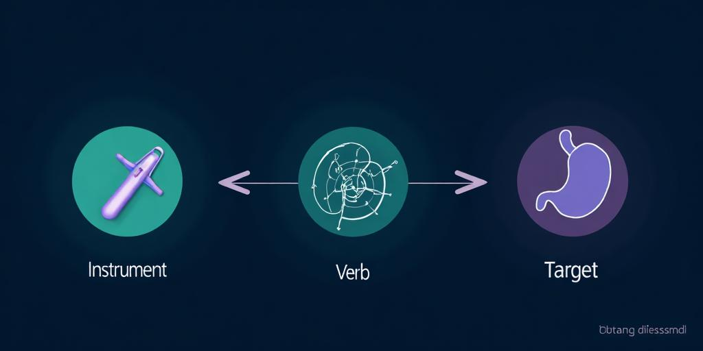

# MultiBypassT40 Challenge Website

Official site for the MultiBypass Surgical Action Triplet Challenge (MICCAI 2026 EndoVis).

<p align="center">
	
</p>

## Challenge at a Glance

- Focus: online surgical action triplet recognition (instrument, verb, target) for Roux-en-Y gastric bypass.
- Dataset: 40 videos from 4 centers; 85 triplet classes.
- Splits: training (16), Future Public Test Set (9), Hidden Test Set (15 across 3 centers).
- Evaluation: triplet mAP (primary) + macro-F1; causal/online only.
- Event: MICCAI 2026, Oct 4–8, ADNEC Centre, Abu Dhabi.

<p align="center">
	
</p>

## Quick Links

- Home: `/` — highlights, news, timeline
- Challenge overview: `/challenge`
- Dataset details: `/dataset`
- Submission guidelines: `/submission`
- Organizers & partners: `/organizers`

## Tech Stack

- Vite + React + TypeScript
- Tailwind CSS + shadcn/ui
- React Router, TanStack Query

## Local Development

```sh
npm install
npm run dev -- --host --port 8020
```

Then open http://localhost:8020.

## Deploy to GitHub Pages

- Vite base path is set to `/mbt40_challenge/` in `vite.config.ts` for project pages.
- Workflow `.github/workflows/deploy.yml` builds and deploys to GitHub Pages on pushes to `main` (or manual dispatch).
- In repository settings, enable Pages with source "GitHub Actions."
- Live URL: `https://camma-public.github.io/mbt40_challenge/`.

## Scripts

- `npm run dev` — start the dev server
- `npm run build` — production build
- `npm run preview` — preview the production build locally

## Project Structure

- `src/pages` — top-level routes (home, challenge, dataset, submission, etc.)
- `src/components` — shared layout and UI components
- `src/assets` — static images and logos
